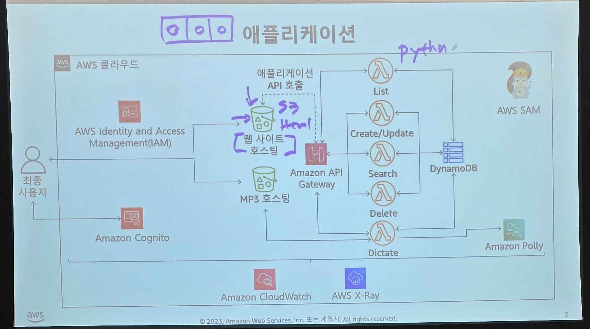
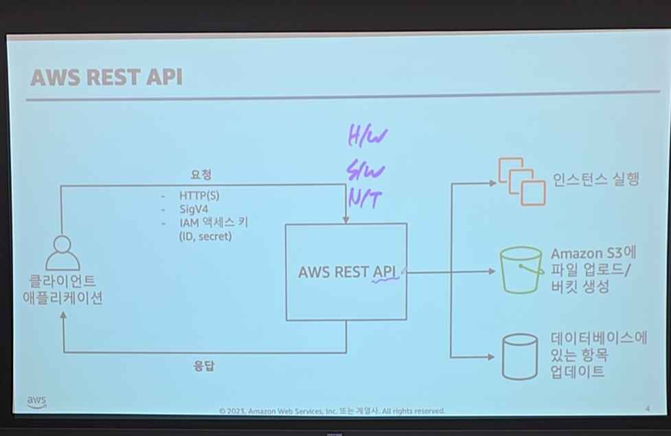
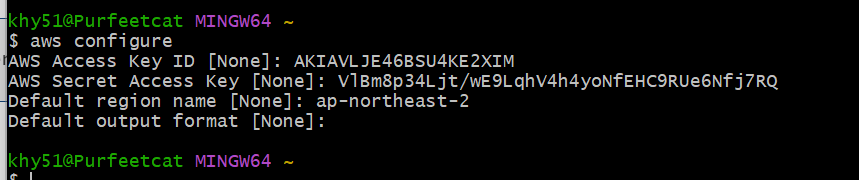
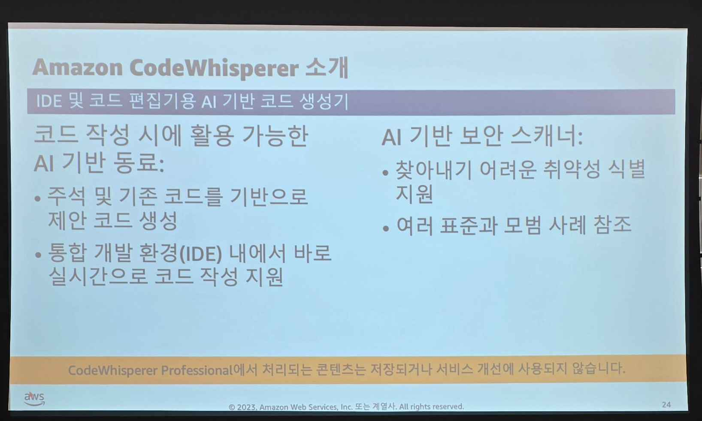
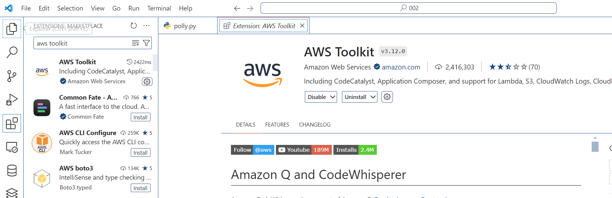

s3 데이터 들어오면, 3개의 가용영역에 복사.. 총 3개 복사됨..





nosql.. 다이나모db.. > 서버리스 데이터 베스.. 3중 저장..

aws.. 레스트풀 api.  




 rest api 쉽게 호출하기 위해서 3가지 방법 제시..

 1. aws management console.. (웹사이트)
 2. aws cli (배치 파일로 실행..)
 3. sdk (파이썬 라이브러리로 제공.)


# aws sdk


aws client!!
comment inter face

[aws 커맨드 설치 파일.](https://docs.aws.amazon.com/cli/latest/userguide/getting-started-install.html)

# aws cli

설치 돼어있는지 확인
```
aws --version
```

MFA  
- 로그인.  

access_key 


```
https://github.com/leftwing872/devaws
```

```
bit.ly/accesskey2024
```


https://docs.google.com/spreadsheets/d/1XOgT2sAsf1lci48U17zArsd7-M3sxFzxA8_6Hfm_vuE/edit?gid=0#gid=0


aws configure

ap-northeast-2





aws s3 ls

버킷만들기
- 버키명은 유니크 해야함..
aws s3 mb [버킷명]
aws s3 mb s3://ozcoding-bamjun003


# 파이썬

boto3
파이썬 sdk 설치
```
pip install boto3
```


```

```

# Amazon Polly  

> 아마존 폴리(Amazon Polly)는 텍스트를 자연스러운 음성으로 변환해주는 AWS 서비스입니다

```
https://github.com/leftwing872/devaws
```

```
https://github.com/leftwing872/devaws/blob/main/tts_polly.py
```


# aws 코딩동료






--- 
--- 
--- 

# aws jam

10가지 과제.

https://jam.awsevents.com/login?eventCode=i4FJp4&redirect_url=d585ce81-73a4-456c-b9e7-046e7779d5c0

## 1 


